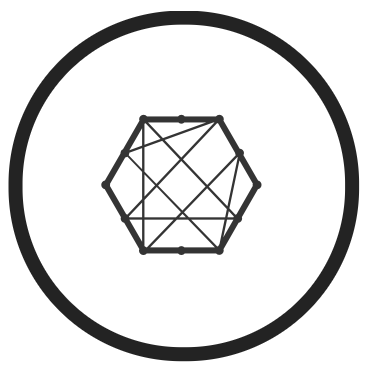
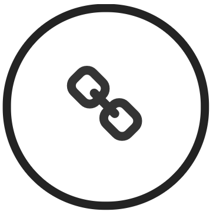

<!-- Banner -->
<section id="banner" class="major">
  

    <header class="major">
      
      <h1 style="vertical-align:middle">&nbsp;{{ page.landing-title }}</h1>
    </header>
    

      
{{ site.description }}

      <ul class="actions">
        <li><a href="#intro" class="button next scrolly">About us</a></li>
      </ul>
    

  

</section>

<!-- Main -->

<!-- One -->
<section id="intro">
  

    <header class="major">
      <h2>Expert blockchain development and consulting</h2>
    </header>
    
Alfa Blockchain Consulting is a global blockchain development and consulting firm headquartered in Barcelona that is focused on building next generation applications using blockchain and smart contract technology. We speed up your team's understanding of the blockchain and its potential opportunities for your business and help you to create a blockchain strategy you can use today. We can furthermore help you with consulting, planning and legal advice of your ICO as well as providing you support before, during and after its execution.

We are blockchain agnostic and are experienced working with many blockchain fabrics including the Bitcoin Blockchain, Ethereum, Ripple. We are also experienced working with different blockchain development APIs, software frameworks, databases, and devOps tools for testing and agile development.

    <ul class="actions">
      <li><a href="#services" class="button next scrolly">Our services</a></li>
    </ul>
  

</section>

<!-- Services -->
<section id="services">
  

    <header class="major">
      <h2>Our services</h2>
    </header>
    

      

        
        <h3>Blockchain Consulting</h3>
        <ul>
          <li>Strategic Planning</li>
          <li>Blockchain Architecture</li>
          <li>Legal Consulting</li>
          <li>Training</li>
        </ul>
      

      

        
        <h3>Blockchain Development</h3>
        <ul>
          <li>Integration with Blockchain</li>
          <li>Smart Contract Development</li>
          <li>Wallet / Explorer</li>
          <li>Admin Analytics</li>
        </ul>
      

      

        
        <h3>Token Development</h3>
        <ul>
          <li>Token Contract</li>
          <li>Crowdsale Contract</li>
          <li>Security Audit</li>
          <li>Contract Deployment</li>
        </ul>
      

      

        
        <h3>Token Distribution</h3>
        <ul>
          <li>Exchange Listings</li>
          <li>Enterprise Partnerships</li>
          <li>Regional Representation</li>
          <li>Legal / Accounting</li>
        </ul>
      

    

    <ul class="actions">
      <li><a href="#team" class="button next scrolly">Our team</a></li>
    </ul>
  

</section>

<!-- clients -->
<!-- <section id="clients">
  

    <header class="major">
      <h2>Clients</h2>
    </header>
    

    <ul class="actions">
      <li><a href="#team" class="button next scrolly">Our team</a></li>
    </ul>
  

</section> -->

<!-- Team -->
<section id="team">
  

    <header class="major">
      <h2>Our team</h2>
    </header>

    

      

        
        <h3>José Cruset</h3>
        <h4>CEO</h4>
      

      

        
        <h3>Chuck LeDuc Díaz</h3>
        <h4>CTO</h4>
      

      

        
        <h3>Simone Guaglianone</h3>
        <h4>Legal</h4>
      

    

    <ul class="actions">
      <li><a href="contact" class="button next">Contact us</a></li>
    </ul>
  

</section>

